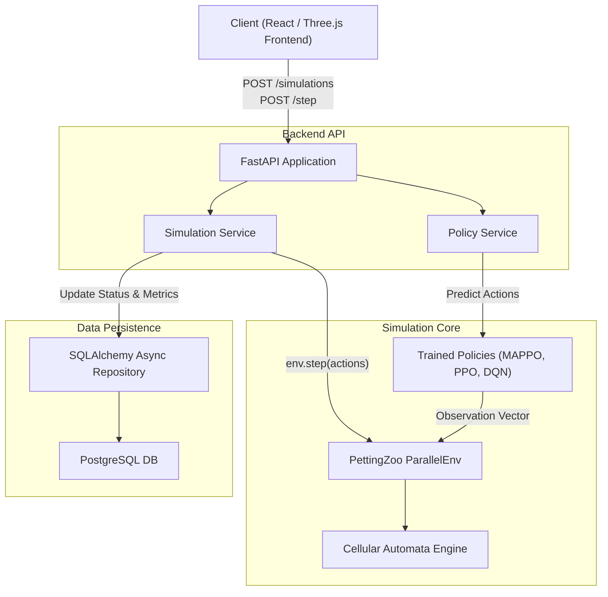

# CrisisRL: Multi-Agent Reinforcement Learning for Dynamic Disaster Response

[](https://www.python.org/)
[](https://pettingzoo.farama.org/)
[](https://gymnasium.farama.org/)
[]()

## Table of Contents
- [Problem Statement](#problem-statement)
- [Solution Overview](#solution-overview)
- [Functional Capabilities](#functional-capabilities)
- [System Architecture](#system-architecture)
- [Technical Stack](#technical-stack)
- [Quick Start](#quick-start)
  - [Prerequisites](#prerequisites)
  - [1. Start the Backend Stack](#1-start-the-backend-stack)
  - [2. Start the Frontend](#2-start-the-frontend)
- [Failure & Edge Case Handling](#failure--edge-case-handling)
- [Test Suite](#test-suite)
- [Configuration](#configuration)
  - [Database Setup](#database-setup)
  - [Environment Variables (Frontend)](#environment-variables-frontend)
- [Project Structure](#project-structure)

---

## Problem Statement
Unlike static evacuation plans, real-world emergency dispatching faces stochastic hazard conditions (such as fire, smoke, or flood progression) with time-critical survival objectives. Existing solutions struggle to dynamically adapt when multiple rescue agents must coordinate without relying on a centralized, omniscient controller.

## Solution Overview
**CrisisRL** is a cooperative Multi-Agent Reinforcement Learning (MARL) framework designed for adaptive emergency dispatch and resource allocation. It treats rescue agents as independent, decentralized actors navigating an evolving disaster environment.

The architecture enforces strict **Information Fairness**:
* **Learned Baselines** (MAPPO, Shared DQN, Independent PPO) possess *only* decentralized, egocentric knowledge (local visual grid + teammate coordinates).
* True cooperative task allocation emerges from the architecture itself, specifically the **Dual-Branch Observation Fusion** inside the learned neural networks.

## Functional Capabilities
- **Discrete Grid Representation (`DisasterGrid`)**: Spatial indexing for fast multi-agent simulation.
- **Stochastic Cellular Automata Hazard Engine**: Non-deterministic modeling of real-world fire/flood spread.
- **PettingZoo ParallelEnv (`DisasterEnv`)**: Multi-agent environment wrapping the engine.
- **MAPPO (Multi-Agent PPO)**: Centralized Training with Decentralized Execution (CTDE) utilizing a global critic and dual-branch actor.
- **RESTful API**: FastAPI server hosting simulations in memory and fetching RL checkpoints dynamically.
- **3D Interactive Dashboard**: A React + Three.js frontend for starting, stepping, pausing, and monitoring the simulations in real-time.

---

## System Architecture



---

## Technical Stack
- **Simulation**: Python, PettingZoo, Gymnasium, Numpy
- **RL Frameworks**: PyTorch
- **Backend API**: FastAPI, Uvicorn, Pydantic
- **Database**: PostgreSQL, SQLAlchemy (Asyncpg), Alembic
- **Frontend**: React 18, Vite, TypeScript, Three.js (`@react-three/fiber`, `@react-three/drei`), TailwindCSS, Axios
- **Testing**: PyTest (Backend), Vitest & React Testing Library (Frontend)

---

## Quick Start

### Prerequisites
1. Python 3.11+
2. Node.js 18+ & npm
3. PostgreSQL Server (Optional: API defaults to in-memory if omitted)
4. Git

### 1. Start the Backend Stack
1. Clone the repository and install requirements:
   ```bash
   git clone https://github.com/Lokesh-g07/disaster-response-marl.git
   cd disaster-response-marl
   pip install -r requirements.txt
   ```
2. Start the FastAPI server:
   ```bash
   python -m uvicorn api.main:app --reload
   ```
3. Verify the backend is running at [http://127.0.0.1:8000/docs](http://127.0.0.1:8000/docs).

### 2. Start the Frontend
1. Open a new terminal and navigate to the frontend directory:
   ```bash
   cd frontend
   npm install
   ```
2. Start the Vite development server:
   ```bash
   npm run dev
   ```
3. Open your browser at [http://localhost:5173](http://localhost:5173).

*(Note: The React dashboard requires the FastAPI server to be running simultaneously to connect to the simulation engine).*

---

## Failure & Edge Case Handling
* **Agent Mismatch**: If you attempt to load a policy checkpoint that was trained on a different number of agents than the currently selected scenario, the FastAPI server will gracefully return an HTTP 400 with a detailed error (e.g., `coord_vector_dim mismatch`). The React frontend parses this and displays it directly in a red error banner rather than crashing the 3D scene.
* **Database Outage**: If the `DATABASE_URL` is omitted or invalid, the backend `SimulationRepository` falls back to purely in-memory execution. Simulations continue to run perfectly.

---

## Test Suite
The project maintains a rigorous, deterministic testing suite.
To execute backend physics and API tests (177 cases):
```bash
python -m pytest -v tests/
```
To execute frontend component tests:
```bash
cd frontend
npm run test
```

---

## Configuration

### Database Setup
To enable permanent logging of simulations and evaluation metrics:
1. Copy `.env.example` to `.env`:
   ```bash
   cp .env.example .env
   ```
2. Set your `DATABASE_URL` inside `.env`.
3. Run Alembic migrations to build the tables:
   ```bash
   python -m alembic upgrade head
   ```

### Environment Variables (Frontend)
By default, the Vite application assumes the FastAPI server is running on `http://localhost:8000`. To change this, create a `frontend/.env` file:
```env
VITE_API_URL=http://your-production-domain.com:8000
```

---

## Project Structure

```text
crisisrl/
├── api/
│   ├── main.py                 # FastAPI Application Factory
│   ├── routes/                 # Controllers (simulations, policies, scenarios)
│   └── services/               # Core business logic (SimulationService)
├── database/                   # Asyncpg SQLAlchemy Models & Repository
├── frontend/                   # React + Three.js Source Code
│   ├── src/three/              # 3D Grid & Disaster Scene Components
│   └── src/api/                # Axios API Client
├── rl/
│   ├── mappo/                  # Dual-Branch MAPPO Actor/Critic Architecture
│   ├── dqn/                    # Shared DQN baseline
│   └── ppo/                    # Independent PPO baseline
├── simulation/
│   ├── engine/                 # Cellular automata and grid mechanics
│   ├── envs/                   # PettingZoo ParallelEnv wrapper
│   └── scenarios/              # JSON definitions for disaster zones
├── baselines/                  # Oracle-level rule-based algorithms
├── training/                   # RL Training Loops
├── evaluation/                 # Deterministic metric tracking
└── tests/                      # 177 PyTest & Vitest cases
```
